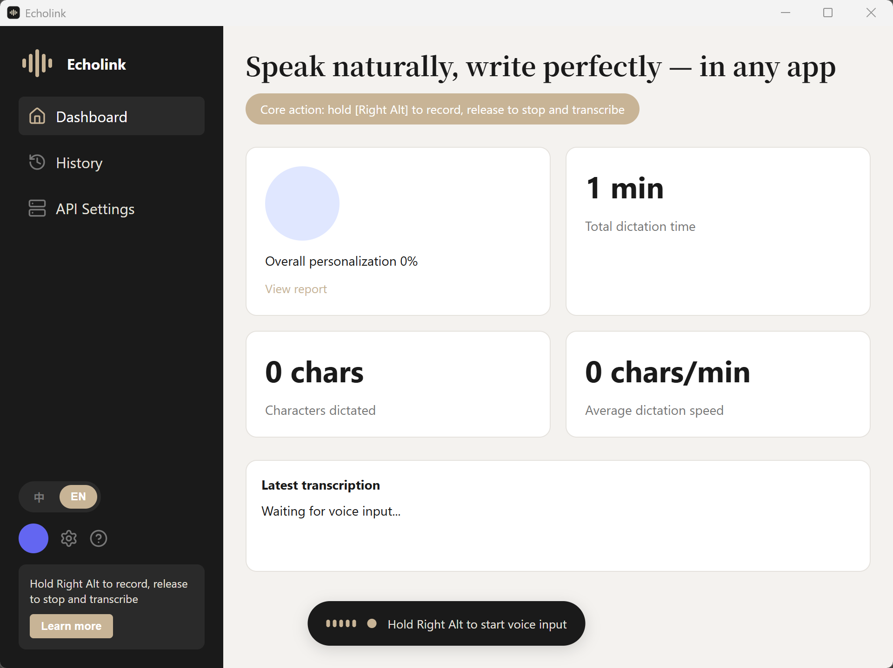

# EchoLink

EchoLink 是一款桌面**语音输入法**:在任何应用里按住 **Right Alt(右 Alt 键)** 说话,松开即把你说的话转写成文字,自动输入到当前光标处。

> 🌐 **官网 / 下载**:<https://stupidloud.github.io/echolink/> · 中英双语界面

## 功能特性

- 🎙️ **全局语音输入** —— 按住 Right Alt 录音,松开自动转写,并把文字输入到当前聚焦的应用(浏览器、聊天工具、编辑器……)。
- ⚡ **多种识别服务** —— 内置三种协议,填上自己的 API Key 即可用:
  - **StepFun SSE**(默认,流式,主界面实时显示转写)
  - **OpenAI 兼容**(Whisper / gpt-4o-transcribe 等)
  - **OpenRouter**(聚合多家语音转写模型)
- 🌊 **桌面悬浮指示器** —— 录音时屏幕底部中央出现波形小药丸;当你正停留在 EchoLink 主窗口时自动隐藏(主界面已有波形条)。
- 📊 **看板与历史** —— 统计口述字数 / 时长 / 速度,保留历史转录记录。
- 🔔 **托盘常驻 + 单实例** —— 关闭窗口后仍在系统托盘运行,点击托盘图标恢复;重复启动只会激活已有窗口,不会开新进程。
- 🌍 **中英双语界面** —— 跟随系统语言,可在侧边栏一键切换 中 / EN;发往识别服务的语种也随界面语言。

## 安装

从 [Releases](https://github.com/stupidloud/echolink/releases) 下载对应系统的安装包:

- **Windows**:`-setup.exe`(NSIS 安装器)
- **macOS**:`.dmg`(Intel 用 `x64`,Apple Silicon 用 `aarch64`)

首次运行需授予权限:

- **麦克风**(录音必需)。
- **macOS 额外需要**:在「系统设置 → 隐私与安全性 → 辅助功能」里勾选 EchoLink,否则无法把文字输入到其他应用。

## 快速上手

1. 打开 EchoLink,进入左侧 **API 服务器设置**。
2. 选择**协议类型**,填入 **接口地址 / API Key / 模型**,点「测试连接」确认可用后「保存」。
3. 切到任意应用,把光标放进输入框,**按住 Right Alt 说话,松开** —— 文字就出现了。

## 协议怎么填

| 协议 | 接口地址示例 | 模型示例 |
|---|---|---|
| StepFun SSE(默认) | `https://api.stepfun.com` | `stepaudio-2.5-asr` |
| OpenAI 兼容 | `https://api.openai.com/v1` | `gpt-4o-transcribe`、`whisper-1` |
| OpenRouter | `https://openrouter.ai/api/v1` | `openai/gpt-4o-transcribe` |

API Key 到对应平台申请。模型框可直接输入或从下拉里选。

## 常见问题

- **按住 Right Alt 没反应?** 确认已授予麦克风权限;macOS 还需在「辅助功能」里勾选 EchoLink。
- **转写结果为空?** 到「API 服务器设置」点「测试连接」,确认 Key 有效、模型在可用列表中。
- **关掉窗口后程序还在?** 这是设计 —— 程序驻留系统托盘。点击托盘图标恢复窗口,托盘菜单「退出」可彻底关闭。
- **Win 键 / 开始菜单受影响?** 不会;EchoLink 只拦截 Alt 触发的窗口菜单,Win 键正常使用。

## 隐私

录音只在你按住 Right Alt 时进行,音频发送到**你自己配置的**识别服务。转录历史保存在本机数据库,不会上传。

---

> 从源码构建、技术栈与开发说明:见 `AGENTS.md` 与项目的 GitHub Actions 工作流(`.github/workflows/build.yml`)。
